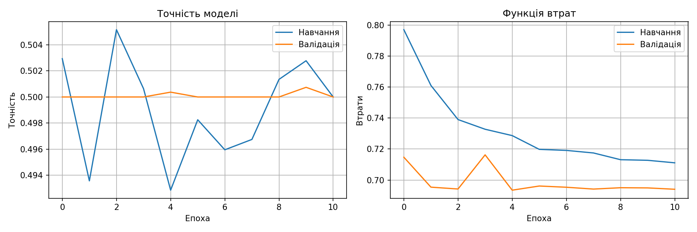
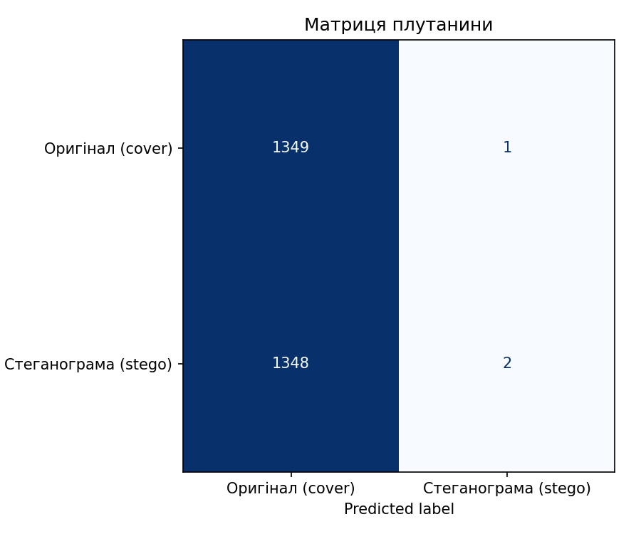
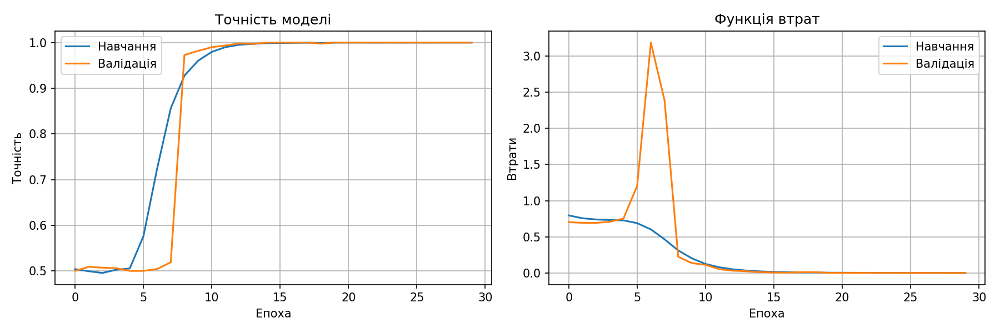
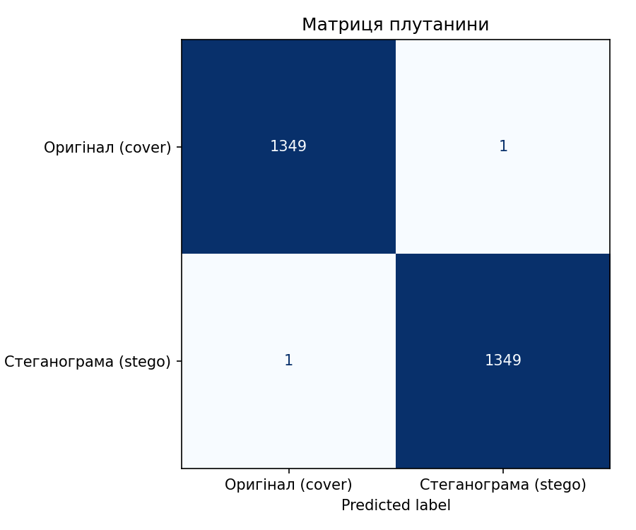

# Hidden Digital Signature using Steganography and Neural Steganalysis


---

## Overview

This project implements a method of hidden electronic signature embedding using LSB steganography and evaluates its robustness using a convolutional neural network (CNN)-based steganalysis model.

The approach combines ECDSA digital signatures with steganographic embedding to ensure both authenticity and concealment of digital documents.

---

## Objectives

- Develop a method for hidden electronic signature generation  
- Embed signatures into images using LSB steganography  
- Build a CNN-based steganalysis model  
- Evaluate robustness against neural steganalysis  

---

## Technologies Used

- Python 3.9  
- TensorFlow / Keras  
- NumPy  
- OpenCV / PIL  
- Matplotlib  

---

## Methodology

### 1. Signature Generation
- Electronic signature generated using ECDSA  
- Converted into a binary sequence  

### 2. Steganographic Embedding
- Signature embedded using LSB method  
- All RGB channels are used  

### 3. Dataset Preparation
- Based on BOSSbase dataset  
- Balanced classes: `cover` and `stego`  
- Split: train / validation / test  

### 4. Steganalysis Model
- CNN with High-Pass Filter (HPF)  
- Designed to detect subtle embedding artifacts  

---

## Experimental Results

### Base Case (512-bit signature)
- Accuracy: **50%**  
- Detection: Not detected  
- PSNR: **76.28 dB**  

### Increased Payload (×8)
- Accuracy: **100%**  
- Detection: Fully detected  
- PSNR: **67.47 dB**  

**Conclusion:** Detection strongly depends on payload size  

---

## Visualization

### Base Case (512-bit payload)
  


### Increased Payload (*8)
  


---

## Project Structure

```bash
hidden-digital-signature-steganalysis/
│
├── images/                 # Visualization results
├── keys/                   # Public key only
├── test_data/              # Sample files
│
├── cli.py
├── dataset_generator.py
├── evaluate.py
├── generate_exp_test.py
├── gui.py
├── key_manager.py
├── lsb_steganography.py
├── signer.py
├── steganalysis_model.py
├── train.py
├── utils.py
├── verifier.py
│
├── .gitignore
└── README.md
```

---

## How to Run

```bash
python dataset_generator.py
python train.py
python evaluate.py
```

---

## Repository Contents
Source code of the system
Sample input files (test_data)
Visualization results (images)
Public cryptographic key

---

## Notes
Large datasets (BOSSbase, generated datasets) are not included due to size limitations
Generated outputs are excluded from the repository

---

## Author
Sofiia Demianenko
